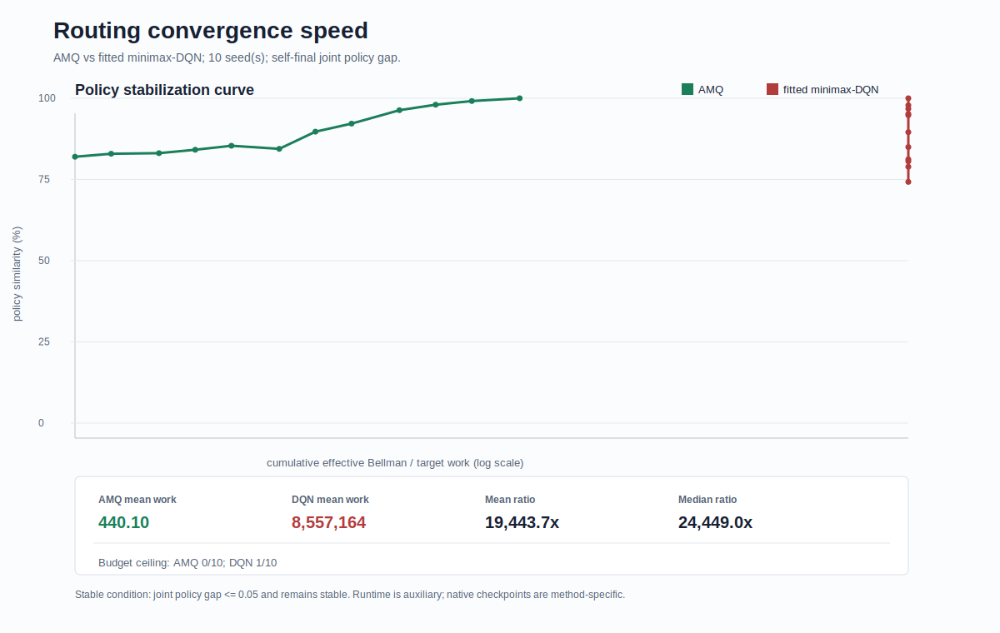
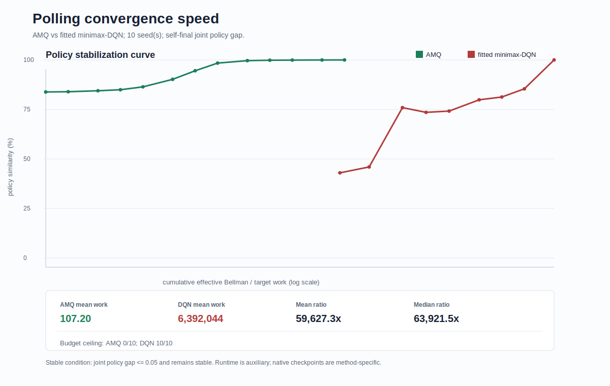

# Convergence Speed Final Report：AMQ vs fitted minimax-DQN

版本：Final，2026-05-20

本报告总结 convergence speed 模块的最终实验设计、算法口径、work accounting 规则和实验结果。核心问题是：

> 从初始化开始，AMQ 和 fitted minimax-DQN 各需要多少算法性工作量，才能稳定到自身最终策略附近？

这里不使用 wall-clock runtime 作为主指标。runtime 受机器性能、BLAS/backend、缓存和实现细节影响太大，因此只作为附录性质的实现信息。

## 0. Executive Summary

本模块比较的是 AMQ 与 fitted minimax-DQN 达到自身 final policy 附近所需的有效 Bellman / target 计算量。稳定标准为 sustained `joint_gap <= 0.05`，其中 `joint_gap` 同时比较 attacker 与 defender policy。

主要结论：

- Routing 和 polling 已完成 full-grid 10-seed evaluation；service-rate-control 是 3-seed extension benchmark。
- Service-rate-control convergence-speed 结果对应旧 LMH 语义，即 defender 直接选择服务率档位。`policy_consistency_final` 已切换到 service-rate-control v2 defend game；两者不能直接混用或并列解读。
- 在三个 benchmark 上，按预注册 `work_to_stable` 口径，AMQ 的 work 显著少于 fitted minimax-DQN。
- Polling 与 service-rate-control 的 DQN 都是在 final checkpoint 才满足稳定判据，因此应解释为 budget ceiling / horizon-censored，而不是 DQN 已经提前稳定。
- Routing DQN 的 primary work 是 model-based fixed-point 预付成本；后续 neural fitting 的工作量单独报告为 secondary fitting work。

总表：

| Benchmark | Seeds | AMQ mean work | DQN mean work | Mean ratio | Median-work ratio | Censoring |
|---|---:|---:|---:|---:|---:|---|
| Routing | 10 | 440.10 | 8,557,164 | 19,443.7x | 24,449.0x | DQN 1/10 budget ceiling |
| Polling | 10 | 107.20 | 6,392,044.40 | 59,627.3x | 63,921.5x | DQN 10/10 budget ceiling |
| Service-rate-control | 3 | 3,400 | 635,968 | 187.0x | 6,359.7x | DQN 3/3, AMQ 1/3 budget ceiling |

## 1. 稳定判据与主指标

策略稳定定义为：某个 checkpoint 的 policy 与同一算法、同一 seed 的 final checkpoint policy 的 `joint_gap <= 0.05`，并且之后所有 checkpoint 也满足该条件。

`joint_gap` 同时比较 attacker 和 defender：

```text
joint_gap = 0.5 * attacker_gap + 0.5 * defender_gap
policy_similarity = (1 - joint_gap) * 100%
```

主速度指标为：

```text
work_to_stable = 到 first stable checkpoint 为止累计的 effective Bellman / target evaluations
```

辅助指标为：

- `stable_native_step`：每个算法自己的 checkpoint 单位，只在算法内部解释。
- runtime：仅作为实现参考，不用于跨算法主结论。

完整 work 账本定义见：`docs/work_accounting_schema.json`。

## 2. 算法口径

### AMQ

AMQ 使用论文形式的在线线性 minimax-Q update：

```text
Q_w(x,a,b) = phi(x,a,b)^T w
Delta_k = cost + value_w(x_next) - Q_w(x,a,b)
w_{k+1} = w_k + eta_k * phi(x,a,b) * Delta_k
```

每一步通过 behavior policy 采样 attacker / defender action，观察 cost 和 next state，在 next state 上解 minimax game，然后用 Robbins-Monro 步长更新 `w`。

禁用：

- BVI label。
- DQN label。
- fitted calibration。
- weight clipping。
- action override。

### fitted minimax-DQN

DQN 按 policy consistency 定稿逐 benchmark 固定：

| Benchmark | DQN 口径 |
|---|---|
| Routing | `neural_fixed_point_q`：先做 model-based minimax-Q fixed point，再用 MLP 拟合 Q function |
| Polling | `NNQTrainer`，`backup_mode=full_action`，`polling_augmented`，50k steps |
| Service-rate-control | `NNQTrainer`，`service_rate_augmented`，10k steps，sampled backup |

因此 routing 中 DQN checkpoint 是 neural fitting epoch，AMQ checkpoint 是 sampled online update，不能直接做 raw step ratio。跨方法比较使用 `work_to_stable`。

## 3. 总结果

| Benchmark | Status | AMQ work_to_stable | DQN work_to_stable | Mean ratio | Median-work ratio | Horizon censoring |
|---|---|---:|---:|---:|---:|---|
| Routing | full-grid, 10 seeds | 440.10 | 8,557,164 | 19,443.7x | 24,449.0x | DQN 1/10 at budget ceiling |
| Polling | full-grid, 10 seeds | 107.20 | 6,392,044.40 | 59,627.3x | 63,921.5x | DQN 10/10 at budget ceiling |
| Service-rate-control | full-grid, 3 seeds extension | 3,400 | 635,968 | 187.0x | 6,359.7x | DQN 3/3, AMQ 1/3 at budget ceiling |

## 4. Routing

Routing 使用：

- `B=20`
- 三队列
- full bounded grid：`21^3 = 9261 states`
- seeds：0–9

图：



结果：

| Method | Mean native stable checkpoint | Median native stable checkpoint | Mean work_to_stable | Median work_to_stable | Secondary fitting target entries at stable |
|---|---:|---:|---:|---:|---:|
| AMQ2 | 440.10 online updates | 350 | 440.10 | 350 | 0 |
| fitted minimax-DQN | 510 fitting epochs | 500 | 8,557,164 | 8,557,164 | 18,892,440 mean |

解释：

- Routing DQN 是 `neural_fixed_point_q`，需要先在 full bounded grid 上求 minimax-Q fixed point。
- DQN 的主 work 定义为：`num_states * 4 action pairs * fixed_point_iterations`。
- 后续 MLP fitting 记录为 secondary neural fitting work，不计入主 Bellman work。正因为如此，DQN 的 `work_to_checkpoint` 在不同 fitting epoch 上是同一个 fixed-point 预付成本，而 policy gap 的下降来自 secondary fitting。
- 若把 primary fixed-point work 和 secondary fitting target entries 合并作为附录性总账，10 个 seed 的 DQN secondary fitting target entries 均值为 18,892,440，中位数为 18,522,000。主表仍按预注册 schema 使用 primary Bellman work。
- Routing DQN 有 1/10 个 seed 在 final fitting epoch 才满足稳定判据，因此该 seed 属于 horizon-censored budget ceiling。
- AMQ 的 stable checkpoint 跨 seed 变化较大，其中有 seed 在 checkpoint 1 即与 final policy 足够接近；因此报告同时给 mean 和 median-work ratio，避免单个极早稳定 seed 扭曲解读。
- Routing learning rate 是 B=20 数值稳定配置，非 AMQ 论文 Table/Fig 的原始 hyperparameter；本实验比较的是按本 benchmark 预注册配置达到 self-stabilization 所需 work。
- 因此 routing 上 AMQ 的优势应表述为“达到稳定所需有效 Bellman/target work 更少”，而不是“运行时间更短”。

## 5. Polling

Polling 使用：

- 三队列 polling
- DQN 定稿配置：`NNQTrainer + full_action + polling_augmented + 50k`
- 本组结果为 full-grid evaluation，seeds：0–9
- evaluation grid：`31^3 * 3 = 89373 states`

图：



结果：

| Method | Mean native stable checkpoint | Median native stable checkpoint | Mean work_to_stable | Status |
|---|---:|---:|---:|---|
| AMQ2 | 107.20 online updates | 100 | 107.20 | full-grid result |
| fitted/full-action DQN | 50,000 steps | 50,000 | 6,392,044.40 | exact distinct-state work; 10/10 budget ceiling |

解释：

- DQN 在 20k 时整体已经接近稳定，但 10 个 seed 都没有在 final checkpoint 之前满足 sustained `joint_gap <= 0.05` 判据。
- 因此 DQN 的 `stable=50,000` 应解释为训练预算内的 horizon-censored ceiling，而不是“已经提前真正稳定”。
- 新版脚本在 training loop 内精确计数 full-action DQN 的 distinct-state target work。10-seed full-grid 下 DQN exact work 均值为 6,392,044.40，中位数为 6,392,146。
- full-grid 下 AMQ stable checkpoint 均值为 107.20，中位数为 100；10/10 个 seed 都在 final checkpoint 之前稳定。

## 6. Service-Rate-Control

Service-rate-control 不是 AMQ 论文原始 benchmark，因此这里是 extension benchmark。该组结果对应旧 LMH 语义：defender 直接选择 low / medium / high 服务率。新版 policy consistency 已将 service-rate-control 改为 v2 defend game，因此本节只作为 legacy extension evidence 保留。

图：


结果：

| Method | Mean native stable checkpoint | Median native stable checkpoint | Mean work_to_stable | Median work_to_stable | Status |
|---|---:|---:|---:|---:|---|
| AMQ extension | 3,400 updates | 100 | 3,400 | 100 | extension evidence; seed2 budget ceiling |
| fitted/sampled DQN | 10,000 steps | 10,000 | 635,968 | 635,968 | finalized DQN config; 3/3 budget ceiling |

解释：

- AMQ 在 seed0/1 上 100 step 稳定，但 seed2 到 10000 才稳定。
- 所以 service-rate-control 的 AMQ native-step 优势不是每个 seed 都全胜。
- 但按预注册 work 账本，AMQ 达到稳定所需 work 仍显著低于 DQN。mean ratio 为 187.0x；若看 median work，典型差距为 6,359.7x。逐 seed ratio 为 6,359.7x / 6,359.7x / 63.6x。
- 该 benchmark 应保守表述为旧语义下的 legacy extension evidence，不应与新版 service-rate-control v2 policy consistency 结果直接合并解读。

## 7. Final Conclusion

最终结果支持：

> 在 convergence speed 的预注册 `work_to_stable` 与 budget-ceiling 口径下，routing 10-seed、polling full-grid 10-seed 与 service-rate-control extension 3-seed 结果都支持 AMQ 使用更少的有效 Bellman/target work；其中 polling/service-rate 的 DQN 结果需按 horizon-censored budget ceiling 解读。

需要保守说明：

- Routing 的 AMQ/DQN native checkpoint 轴不同，不能写 raw step ratio。
- Polling 与 service-rate DQN 的 stable checkpoint 等于 final checkpoint，应作为 budget ceiling / horizon-censored 结果解读。
- Routing 和 polling 已完成 10-seed full-grid evaluation；service-rate-control 仍是 3-seed extension evidence。
- Service-rate-control 是 AMQ paper-form update 的 extension，不是 AMQ 论文原始 benchmark。
- Runtime 不作为主结论证据。

## 8. Work Accounting Intuition

为什么 work ratio 会达到 `10^4` 到 `10^5` 量级？

核心原因是两类方法的计算组织方式不同：

- AMQ 是在线线性 update。每个 transition 只做一次 sampled TD target 和一次 linear-weight update，所以 AMQ 的 `work_to_stable` 与 stable update index 基本相同。
- Routing fitted minimax-DQN 先在 full bounded grid 上求 model-based minimax-Q fixed point。即使后续 neural fitting 很快稳定，主 Bellman work 已经预付为 `9261 states * 4 action pairs * 231 iterations = 8,557,164`。
- Polling full-action DQN 每个 replay batch 会对 distinct sampled states 的所有 attacker/defender action pairs 计算 target。50k budget 下累计 target work 约为 `6.39M`。
- Service-rate sampled DQN 每个 replay batch 计算 `batch_size` 个 sampled TD targets；10k budget 下累计 target work 为 `635,968`。

因此本实验中的“AMQ 更快”不是 wall-clock 更快，而是按预注册账本，AMQ 达到 self-stabilization 所需的 Bellman/target 语义计算量更少。

## 9. 与 Policy Consistency 的关系

Policy consistency 与 convergence speed 是两个不同模块：

- Policy consistency 关注 BVI 与 fitted minimax-DQN 学到的最终策略是否一致，回答的是“最终策略质量/方向是否接近”。
- Convergence speed 关注 AMQ 与 fitted minimax-DQN 各自多快稳定到自己的 final policy，回答的是“训练过程中策略多久不再明显变化”。

因此，DQN 在 policy consistency 中可以与 BVI 高度一致，但在 convergence speed 中仍可能需要更大的 work budget 才接近自身 final policy。两者不矛盾：前者是最终策略相似性，后者是训练稳定速度。

## 10. Limitations

- Polling 和 service-rate 的 DQN 结果存在 horizon censoring：DQN 都是在 final checkpoint 才满足稳定判据。因此这些结果应解释为本次 budget 下的 ceiling，而不是 DQN 已提前稳定。
- Routing DQN 的 primary `work_to_stable` 是 fixed-point 预付成本，与 native fitting epoch 的早晚解耦；报告中已用 secondary fitting target entries 解释 gap 下降阶段。
- Routing 和 polling 已扩展为 10 seeds；service-rate-control 仍是旧 LMH 语义下的 3-seed legacy extension evidence。后续若要与新版 service-rate-control v2 对齐，需要重新设计并重跑 convergence-speed service-rate 实验。
- AMQ learning rate 是为本次 B=20 / max-queue setting 选择的数值稳定配置，不等同于原论文所有图表的 hyperparameter。
- 本报告只比较 convergence speed，不比较最终 performance，也不替代 policy consistency 结论。

## 11. 文件、代码结构与复现线索

本目录是 convergence speed 模块的最终工作区。目录结构如下：

```text
covergence_speed_final/
  convergence_speed_report_zh.md
  code/
  docs/
  figures/
  results/
```

其中 `convergence_speed_report_zh.md` 是本报告；`figures/` 保存报告中的 convergence speed 曲线；`results/` 保存每个 seed 的 `summary.json` 与聚合后的 summary；`docs/` 保存实验计划、work accounting schema 与阶段性说明；`code/` 保存最终 runner 与聚合脚本。

代码结构如下：

```text
code/
  routing_convergence_speed.py
  polling_convergence_speed.py
  service_rate_convergence_speed.py
  build_routing_convergence_summary.py
```

各文件作用如下。

| Path | Role |
|---|---|
| `code/routing_convergence_speed.py` | Routing convergence-speed runner。实现 paper-form AMQ1/AMQ2 线性 minimax-Q update，并与 routing 的 fitted minimax-DQN / `neural_fixed_point_q` 做 self-stabilization 比较。 |
| `code/polling_convergence_speed.py` | Polling 三队列 convergence-speed runner。AMQ 侧使用 paper-form AMQ2 特征模板；DQN 侧使用最终 policy-consistency 口径中的 `NNQTrainer + full_action + polling_augmented`。脚本在 training loop 内记录 exact distinct-state target work。 |
| `code/service_rate_convergence_speed.py` | Service-rate-control extension runner。AMQ 侧为线性 AMQ extension；DQN 侧使用 `NNQTrainer + sampled backup + service_rate_augmented`。 |
| `code/build_routing_convergence_summary.py` | 通用聚合与绘图脚本。读取多个 per-seed `summary.json`，计算 mean/median `work_to_stable`、horizon censoring、per-seed ratio，并生成报告用 SVG 曲线。虽然文件名保留 routing，它也用于 polling 与 service-rate 的 summary 聚合。 |

这些 convergence runner 复用同仓库 `policy_consistency_final/code` 中的最终算法实现：

- `policy_consistency_final/code/src/adversarial_queueing/algorithms/nnq.py`
- `policy_consistency_final/code/src/adversarial_queueing/algorithms/minimax_solver.py`
- `policy_consistency_final/code/src/adversarial_queueing/envs/`
- `policy_consistency_final/code/experiments/source_faithful_routing_consistency/routing_bvi_dqn_consistency.py`

也就是说，本模块本身负责 convergence-speed 协议、checkpoint、work accounting 与聚合；底层 benchmark 环境、DQN/NNQ 网络、matrix-game solver 与 routing fitted minimax-DQN 由 `policy_consistency_final/code` 提供。这样可以避免 convergence speed 与 policy consistency 使用两套不一致的算法实现。

关键文档与结果文件如下：

| Path | Content |
|---|---|
| `docs/work_accounting_schema.json` | 预注册 work 账本：定义 `work_to_stable`、native checkpoint、horizon censoring 与 secondary work。 |
| `docs/convergence_speed_experiment_plan_zh.md` | convergence speed 实验设计与方法口径。 |
| `docs/routing_convergence_progress_zh.md` | Routing 实验过程、参数与中间判断。 |
| `docs/polling_convergence_progress_zh.md` | Polling full-grid / 10-seed 实验过程与结果解释。 |
| `docs/service_rate_convergence_progress_zh.md` | Service-rate-control extension 的过程说明。 |
| `docs/cursor_alignment_notes_zh.md` | 与外部审阅反馈对齐后的修正记录。 |
| `results/routing_b20_10seed_summary.json` | Routing 10-seed 聚合结果。 |
| `results/polling_10seed_fullgrid_summary.json` | Polling 10-seed full-grid 聚合结果。 |
| `results/service_rate_3seed_summary.json` | Service-rate-control 3-seed extension 聚合结果。 |

每个 per-seed 结果目录，例如 `results/routing_b20_seed0/`、`results/polling_fullgrid_seed0_50k/`、`results/service_rate_seed0/`，都包含一个 `summary.json`。这些文件记录：

- AMQ 与 DQN 的 config；
- 每个 checkpoint 的 policy gap；
- `work_to_checkpoint` / effective target work；
- `stable_checkpoint`；
- `stable_before_horizon` 与 `censored_at_horizon`；
- 用于聚合表和曲线的 per-seed 统计量。

复现时的顺序是：

1. 用对应 runner 生成每个 seed 的 `summary.json`；
2. 用 `code/build_routing_convergence_summary.py` 聚合多个 seed；
3. 读取聚合 summary 与 SVG 更新本报告。

需要注意，本目录名沿用了历史拼写 `covergence_speed_final`；为了路径稳定，没有在最终仓库中改名。
