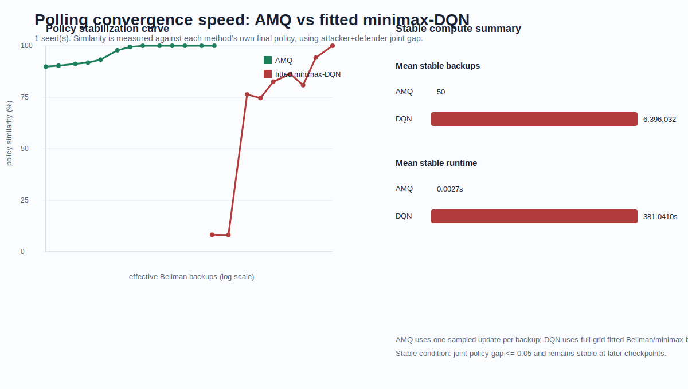

# Polling Convergence Speed 阶段性记录

本文档记录新版 convergence speed 实验在三队列 polling benchmark 上的迁移进展。

## 1. 当前锁定口径

### AMQ

Polling AMQ 使用 AMQ 论文 Appendix A.2 的 AMQ2 分块特征形式，并按本项目 polling 环境的目标选择语义适配 `delta_i`：

```text
phi_i = [1, x_i + delta_i, (x_i + delta_i)^2, a, b, 1{i = server_position}]
```

其中：

- `x_i` 是第 `i` 条队列长度。
- `a` 是 attacker action。
- `b` 是 defender action。
- `delta_i=1` 表示当前 action pair 下 polling target 包含队列 `i`。
- 额外的 `1{i = server_position}` 用来表示 polling 状态中的 server position。

训练过程仍为论文 Algorithm 1 的在线 AMQ：

- 状态依赖 behavior policy `alpha(.|x), beta(.|x)`。
- Robbins-Monro 步长。
- 不使用 fitted calibration。
- 不使用 weight clipping。
- 不使用 BVI/DQN label。

当前 smoke 使用：

```text
eta_k = 1e-7 / k^0.6
```

### DQN

Polling DQN 逐字段采用 policy consistency 定稿配置：

```text
NNQTrainer
backup_mode = full_action
state_feature_set = polling_augmented
hidden_size = 64
learning_rate = 0.001
batch_size = 32
replay_capacity = 4096
target_update_interval = 200
epsilon = 0.15
exploring_starts_probability = 0.5
exploring_starts_max_queue_length = 30
total_steps = 50000
```

这和 routing 的 `neural_fixed_point_q` 不同。后续报告里必须按 benchmark 分别说明 DQN 版本，不能笼统写成同一套 fitted minimax-DQN。

## 2. 状态与评估

Polling 使用三条队列，状态为：

```text
(q1, q2, q3, server_position)
```

正式 full-grid evaluation 对应：

```text
31^3 * 3 = 89373 states
```

当前 smoke 使用 `eval_state_limit=512`，仅用于检查训练与稳定性轨迹，不作为最终正式结论。

## 3. 已完成 smoke

短 smoke：

`../results/polling_smoke_seed0_short/summary.json`

10k smoke：

`../results/polling_smoke_seed0_10k/summary.json`

10k smoke 的结果显示：

| Method | Stable checkpoint | Runtime at stable | Note |
|---|---:|---:|---|
| AMQ2 | 50 | 0.0026s | 相对 10k final policy 很早稳定 |
| DQN | 10000 | 67.8189s | 10k 被当作 final，因此还不能代表 50k 定稿口径 |

因此必须继续跑 50k smoke，不能用 10k 终点冒充 policy consistency 定稿 DQN 的最终策略。

## 4. 正在推进

已完成 50k smoke：

```text
../results/polling_smoke_seed0_50k/
```

该 run 使用 DQN final checkpoint = 50000，并保留中间 checkpoint：

```text
100, 200, 500, 1000, 2000, 5000, 10000, 20000, 50000
```

跑完后应检查 DQN 是否在 20k 或更早已经相对 50k final policy 稳定。如果仍然只在 50k 稳定，需要如实记录。

结果如下：

| Method | Stable checkpoint | Work_to_stable | Runtime status | Note |
|---|---:|---:|---|---|
| AMQ2 | 50 | 50 | auxiliary only | 很早稳定到自身 10k final policy |
| fitted/full-action DQN | 50000 | 6,392,172 | auxiliary only | 20k 的 joint gap 为 0.0565，略高于 0.05 阈值；旧上界为 6,396,032 |

图：



关键 checkpoint：

| Method | Checkpoint | Joint gap | Policy similarity |
|---|---:|---:|---:|
| AMQ2 | 20 | 0.0623 | 93.77% |
| AMQ2 | 50 | 0.0254 | 97.46% |
| AMQ2 | 100 | 0.0064 | 99.36% |
| DQN | 10000 | 0.2027 | 79.73% |
| DQN | 20000 | 0.0565 | 94.35% |
| DQN | 50000 | 0.0000 | 100.00% |

按照预注册 `joint_gap <= 0.05` 的稳定标准，DQN 不能记为 20k 稳定。由于 50k 是 final checkpoint，`stable=50k` 应解读为 budget ceiling / horizon-censored 结果，而不是 DQN 已经在预算内提前稳定。这一点需要在最终报告中保留，不能把阈值临时放宽到 0.06。

## 5. 10-seed full-grid 聚合

已完成 seed 0–9 的 50k full-grid evaluation，使用完整 `31^3 * 3 = 89373` 个状态。

聚合结果：

`../results/polling_10seed_fullgrid_summary.json`

图：


| Method | Mean native stable checkpoint | Median native stable checkpoint | Mean work_to_stable | Status |
|---|---:|---:|---:|---|
| AMQ2 | 107.20 | 100 | 107.20 | full-grid result |
| fitted/full-action DQN | 50000 | 50000 | 6,392,044.40 | exact distinct-state work; 10/10 budget ceiling |

逐 seed 结果：

| Seed | AMQ stable update | DQN stable step | DQN budget censored |
|---:|---:|---:|---|
| 0 | 50 | 50000 | yes |
| 1 | 100 | 50000 | yes |
| 2 | 200 | 50000 | yes |
| 3 | 200 | 50000 | yes |
| 4 | 1 | 50000 | yes |
| 5 | 200 | 50000 | yes |
| 6 | 1 | 50000 | yes |
| 7 | 20 | 50000 | yes |
| 8 | 100 | 50000 | yes |
| 9 | 200 | 50000 | yes |

这说明 polling 上的趋势不是 seed 0 偶然现象。尤其需要保留一个细节：10 个 seed 的 DQN 都是在 final checkpoint 50000 才满足稳定判据，均属于 horizon-censored budget ceiling。

新版 exact-work 重跑已完成。DQN 在 50k checkpoint 的 exact work 均值为 6,392,044.40，中位数为 6,392,146，略低于旧上界 `6,396,032 = num_gradient_updates * batch_size * 4`。这说明 distinct-state counter 生效；由于 replay batch 中重复 state 不多，exact work 只比上界略低。

## 6. 下一步

Polling 的 10-seed full-grid exact-work evaluation 已完成，可纳入 final 报告主表。

新版脚本已经加入 exact work counter，后续重跑 polling 时会按每个 replay batch 中的 distinct states 计数 full-action target work；runtime 不作为主比较指标。
