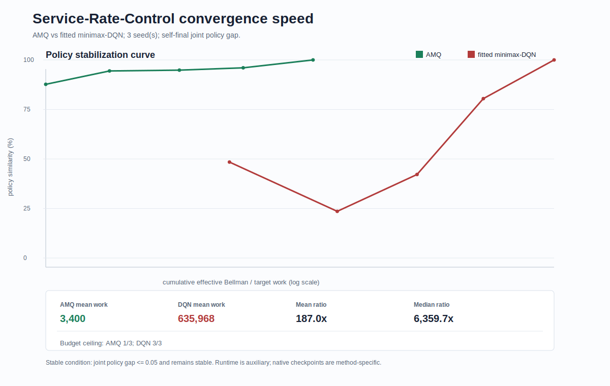

# Service-Rate-Control Convergence Speed 阶段性记录

Service-rate-control 不是 AMQ 论文原始 benchmark，因此本部分只能表述为：

> 将论文形式的在线线性 minimax-Q / AMQ update 应用于 service-rate-control extension benchmark。

不能写成 AMQ 论文原始实验复现。

## 1. 当前口径

### AMQ extension

AMQ 使用线性 Q：

```text
Q_w(x,a,b) = phi(x,a,b)^T w
```

其中 service-rate-control 是单队列状态，defender 有三档 service-rate action。特征包含：

- `1, x, x^2`
- attacker one-hot
- defender one-hot
- `x * defender_one_hot`
- `x^2 * defender_one_hot`
- attacker-defender joint action interaction

训练仍按 AMQ Algorithm 1：

- behavior policy 采样 attacker / defender action。
- 观察 cost 和 next state。
- 在 next state 上解 minimax game。
- 用 Robbins-Monro 步长更新线性权重。

由于 defender 有三档动作，这里解的是 `2 x 3` matrix game，使用 LP solver；这也是 service-rate-control 比 routing/polling extension 更慢的一个原因。

### DQN

DQN 使用 policy consistency 定稿 service-rate config：

```text
NNQTrainer
state_feature_set = service_rate_augmented
hidden_size = 32
learning_rate = 0.0005
total_steps = 10000
batch_size = 64
replay_capacity = 10000
target_update_interval = 250
epsilon = 0.1
backup_mode = sampled
```

## 2. Evaluation

Full bounded grid：

```text
states = {0, 1, ..., 20}
num_eval_states = 21
```

Policy gap 同时比较：

- attacker attack probability。
- defender 三档 service-rate mixed distribution。

Defender gap 使用 total variation distance。

## 3. 3-seed 结果

结果文件：

`../results/service_rate_3seed_summary.json`

图：



聚合结果：

| Method | Mean native stable checkpoint | Median native stable checkpoint | Mean work_to_stable | Runtime status |
|---|---:|---:|---:|---|
| AMQ extension | 3400 | 100 | 3400 | auxiliary only |
| fitted/sampled DQN | 10000 | 10000 | 635,968 | auxiliary only |

逐 seed：

| Seed | AMQ stable step | AMQ work_to_stable | DQN stable step | DQN work_to_stable |
|---:|---:|---:|---:|---:|
| 0 | 100 | 100 | 10000 | 635,968 |
| 1 | 100 | 100 | 10000 | 635,968 |
| 2 | 10000 | 10000 | 10000 | 635,968 |

解释：

- service-rate-control 上 AMQ extension 的 seed-level step 不是全胜，seed2 直到 10000 才稳定。
- 但 AMQ 的 `work_to_stable` 仍显著低于 DQN。
- DQN 三个 seed 都在 final checkpoint 才满足稳定判据，应按 budget ceiling / horizon-censored 结果解读；AMQ seed2 也属于 horizon-censored。
- mean work ratio 为 187.0x，median work ratio 为 6,359.7x；后者更能反映 seed0/1 的典型差距。
- 由于该 benchmark 是 extension，最终报告应比 routing/polling 更保守。

## 4. 下一步

三类 benchmark 目前都已有新版 convergence speed 结果：

- routing：full-grid 3-seed。
- polling：full-grid 3-seed。
- service-rate-control：full-grid 3-seed。

下一步应生成 convergence_speed_final 的总报告，把三个 benchmark 放在一张总表里，并明确标注 routing/polling/service-rate 的 DQN 版本不同。
