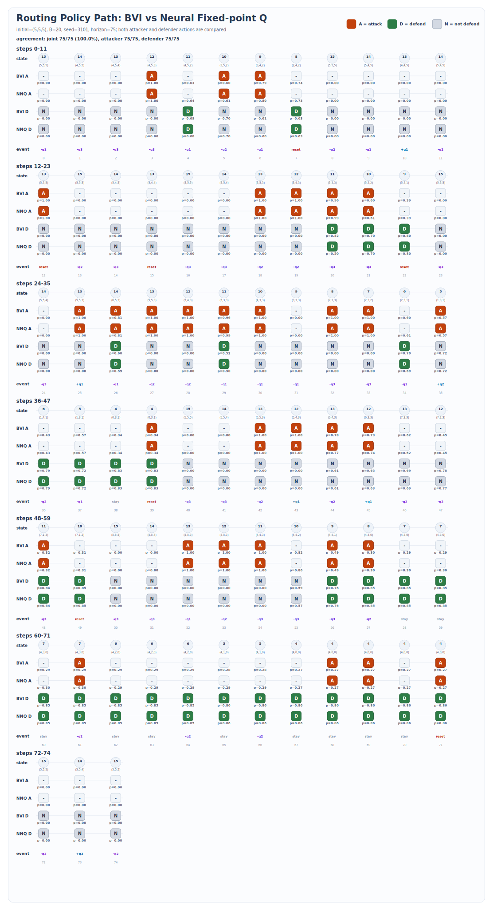
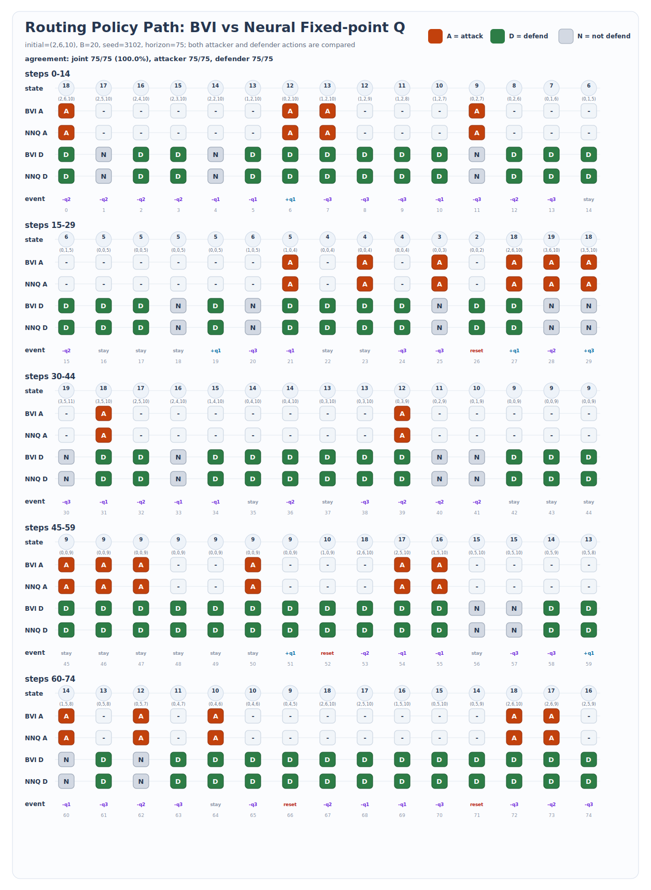
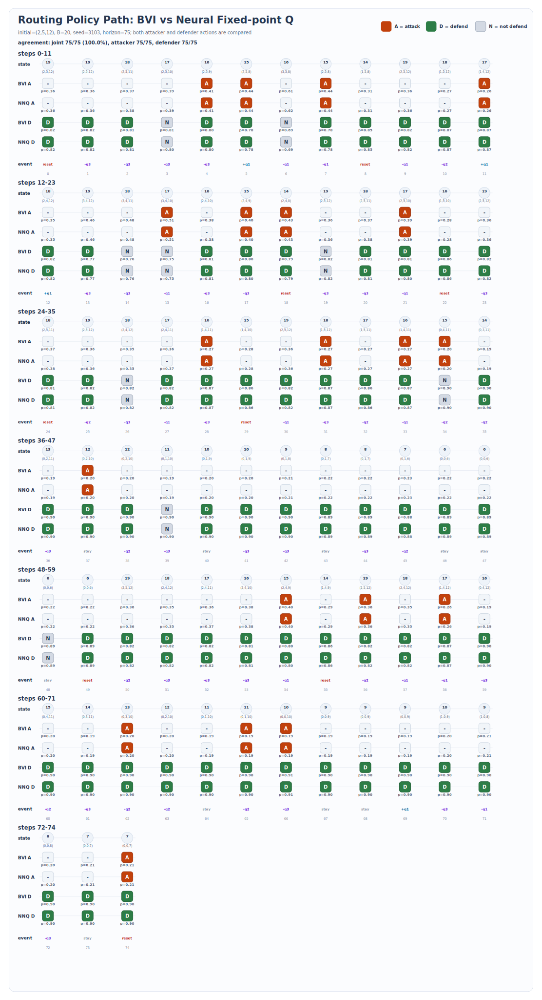
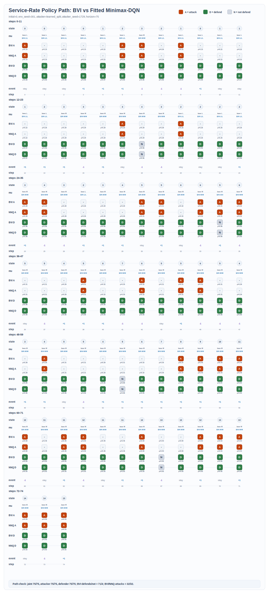
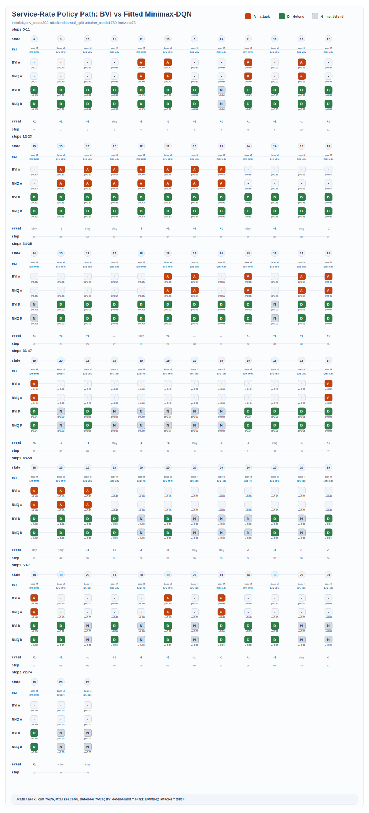
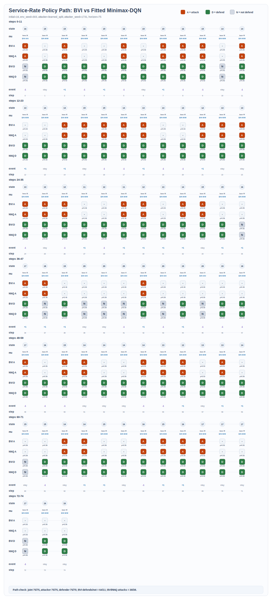
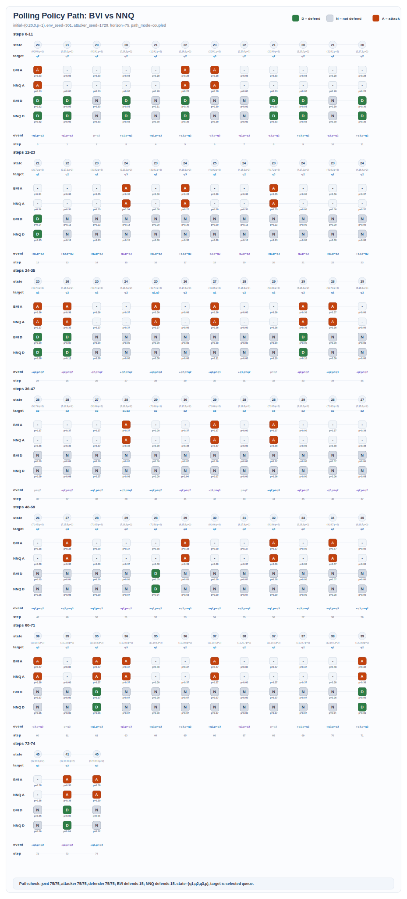
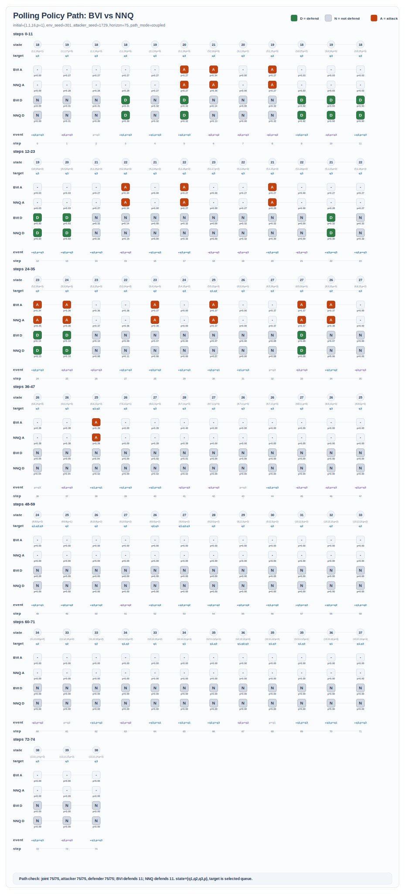
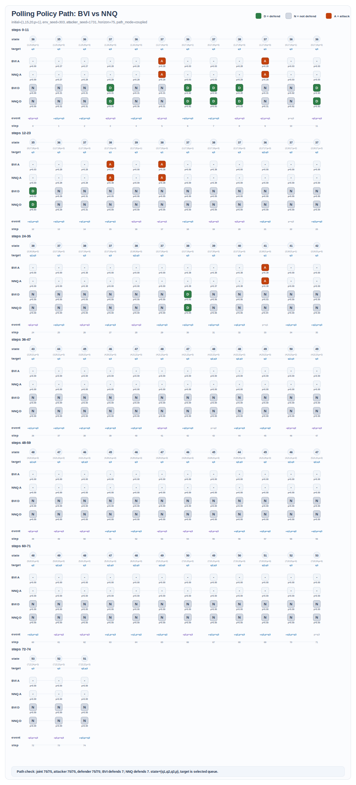

# Policy Consistency 实验报告

## 1. 实验目标

本实验关注 BVI 与 fitted minimax-DQN 在三个 queueing benchmark 上的策略一致性。这里的“策略一致性”不是直接比较参数，也不是比较 value function，而是把训练后的两个策略放回真实环境中，从相同初始状态出发，在相同环境随机数与相同 action sampling random numbers 下 rollout 75 步，并逐步比较两者在每一步给出的 joint action：

$$
\text{joint action}=(\text{attacker action},\ \text{defender action})
$$

策略相似度定义为：

$$
\text{policy consistency}
=
\frac{\text{matched joint-action steps}}{\text{total rollout steps}}
\times 100\%.
$$

本报告共展示三个 benchmark，每个 benchmark 三条 75-step 决策链路，共 9 张结果图。

## 2. 算法口径

### 2.1 BVI

BVI 在本项目中采用论文里的 bounded value iteration / adapted Shapley iteration 口径。它不是神经网络，也不是采样式 reinforcement learning；它是在截断后的有限状态空间上维护一个逐状态定义的 value function `V(x)`。由于截断后 `X_B` 是有限集合，代码实现中这个 `V(x)` 就表现为一个有限数组/字典；论文 Algorithm 2 的原文口径是 `Set V(x)=0 for all x in X={0,1,2,...,B}^n`，随后在每个 state 上构造局部 zero-sum matrix game 来做 Bellman backup。

真实 queueing state space 是无界的，例如 routing 中：

$$
x=(x_1,x_2,x_3), \qquad x_i\in\{0,1,2,\ldots\}.
$$

BVI 先给出 queue length upper bound `B`，只在 bounded grid 上迭代：

$$
\mathcal X_B=\{0,1,\ldots,B\}^n.
$$

然后维护：

$$
V(x), \qquad x\in\mathcal X_B.
$$

初始化为 `V(x)=0`，每一轮对所有 bounded states 同步更新：

$$
\begin{aligned}
M_x(V_{\mathrm{old}}) &= \text{one-state attacker-defender payoff matrix},\\
V_{\mathrm{new}}(x) &= \operatorname{val}\!\left(M_x(V_{\mathrm{old}})\right),\\
\mathrm{residual} &= \max_{x\in\mathcal X_B}
\left|V_{\mathrm{new}}(x)-V_{\mathrm{old}}(x)\right|.
\end{aligned}
$$

上述更新对所有 bounded states 重复执行，直到 residual 小于 tolerance。

因此，如果用“训练”这个词来类比，BVI 的训练过程就是在 bounded state grid 上反复做 Bellman / Shapley backup：它没有神经网络参数、没有 loss function、也没有 backpropagation；每轮直接用上一轮的 value function 构造 matrix game，再把该 matrix game 的 minimax value 写回为新的 `V(x)`。收敛后，最终的 `V(x)` 就作为 policy extraction 的依据。

这里 `M_x(V_old)` 的每个元素都是某个 attacker-defender action pair 下的 one-step cost plus future value：

$$
M_x(a,b)
=
c(x,a,b)
\;+\;
\gamma\,\mathbb E\!\left[V_{\mathrm{old}}(x')\mid x,a,b\right].
$$

矩阵的行是 attacker action，列是 defender action；矩阵元素按 defender cost / attacker reward 记。BVI 更新的不是简单的 `min` 或 `max`，而是 zero-sum game value：

$$
V_{\mathrm{new}}(x)
=
\operatorname{val}(M_x)
=
\min_{\text{defender}}\max_{\text{attacker}} M_x(a,b).
$$

收敛后，再用最终的 `V` 对每个 state 重新构造 `M_x(V)`，并从同一个 matrix game solution 中读出 attacker equilibrium policy 与 defender equilibrium policy。因此 BVI 的 policy 是由 bounded value table 和局部 matrix game 共同决定的，不是手工规则。

Routing benchmark 使用论文 security setting 的 2 x 2 auxiliary matrix game。Attacker actions 为：

```text
NA = not attack
A  = attack
```

Defender actions 为：

```text
NP = not protect / not defend
P  = protect / defend
```

若 attacker attack 且 defender not defend，则新任务被路由到最长队列；其他 action pairs 下，新任务被路由到最短队列。令：

$$
x_{\mathrm{short}} = x + e_{\mathrm{shortest}},
\qquad
x_{\mathrm{long}} = x + e_{\mathrm{longest}}.
$$

$$
\delta(x)
=
\tilde\lambda
\left[
V(x_{\mathrm{long}})
-
V(x_{\mathrm{short}})
\right].
$$

其中 `delta(x)` 表示攻击成功把 arrival 从最短队列改到最长队列后带来的额外 future value。再令：

$$
C(x)
=
\lVert x\rVert_1
+
\tilde\mu\sum_i V\!\left((x-e_i)^+\right)
+
\tilde\lambda V(x_{\mathrm{short}}).
$$

则 routing 的 BVI auxiliary matrix 为：

$$
M(x,V)=
\begin{array}{c|cc}
 & \text{defender NP} & \text{defender P}\\
\hline
\text{attacker NA}
& C(x)
& C(x)+c_b\\
\text{attacker A}
& C(x)-c_a+\delta(x)
& C(x)-c_a+c_b
\end{array}
$$

其中 `c_a` 是 attack cost，`c_b` 是 defend cost。这个 2 x 2 game 在实现中按论文 closed-form regime 求解：

$$
\begin{cases}
\delta(x)\le c_a:
& \alpha^*(x)=\text{NA},\quad \beta^*(x)=\text{NP},\\[2mm]
c_a<\delta(x)\le c_b:
& \alpha^*(x)=\text{A},\quad \beta^*(x)=\text{NP},\\[2mm]
\delta(x)>\max\{c_a,c_b\}:
& p_{\mathrm{attack}}=\dfrac{c_b}{\delta(x)},\quad
  p_{\mathrm{defend}}=1-\dfrac{c_a}{\delta(x)}.
\end{cases}
$$

也就是说，`delta` 越大，当前状态越不平衡，攻击成功造成的长期损害越大；当 `delta` 大到足以让双方都采取随机化策略时，BVI 输出 mixed attacker/defender policies，而不是固定动作。

本报告实际实验中的 BVI 设置如下：

- Routing：使用论文 security setting 的 source-faithful BVI，三队列 `x=(q1,q2,q3)`，`B=20`，每个 state 解上述 2 x 2 auxiliary matrix game。
- Service-rate-control v3 candidate：使用同一类 bounded value iteration 思路，bounded queue length 为 `0..20`；attacker 为 binary action，defender 为 `defend / not defend` 二元动作，policy 由对应 state 的 2 x 2 matrix game solution 给出。这里没有改变 BVI 算法，只是将 service-rate benchmark 从低活动 v2 重新参数化为更适合压力测试的 v3 candidate。
- Polling：使用三队列 bounded value iteration，state 为 `(q1,q2,q3,p)`，`max_queue_length=30`，其中 `p` 是 server position；BVI 只截断 queue components，不截断 server position。

当 rollout 中真实转移产生超过 bound 的 queue length 时，BVI 查表时会将 queue length clip 到 bound。这个 clip 只用于 bounded value lookup；真实环境 rollout 本身仍按环境转移继续走。

### 2.2 Fitted Minimax-DQN / NNQ

本报告没有采用最原始的 online sampled DQN 作为最终 policy consistency 对象，原因是这个问题比普通 single-agent DQN 更敏感。每个 state 下要学习的不是一个 action value vector，而是一个 attacker-defender matrix game；最终动作由 matrix game equilibrium 决定。这样会带来一个实际困难：如果 Q matrix 中 action-dependent 的差异本来就很小，少量 sampling noise 或 bootstrap error 就可能改变 equilibrium regime，导致 attacker / defender 的 mixed policy 或 argmax action 发生明显跳变。也就是说，raw DQN 的不稳定不一定说明目标策略不同，很多时候只是 sampled TD target、replay coverage 和 target-network bootstrap 的噪声被 matrix-game solver 放大了。

因此，本模块采用 fitted minimax-DQN / NNQ 作为最终 DQN 口径：仍然用神经网络表示 $Q_\theta(s,a,b)$，仍然通过 Bellman / minimax-Q target 训练，仍然在 policy extraction 时解 zero-sum matrix game；但在训练工程上使用更低噪声、更稳定的 target 构造和 fitting 过程。这样做的目的不是让 DQN “照抄” BVI policy，而是尽量检验一个神经网络 Q 近似器在同一 stochastic game 结构下能否学到与 BVI 一致的 equilibrium policy。换句话说，raw online DQN 更适合用来研究训练难度和 sample complexity；本报告的目标则是研究最终 policy consistency，所以采用稳定后的 fitted minimax-DQN 作为 NNQ 代表。

需要强调的是，本报告的 DQN 侧不使用 BVI policy label、AMQ teacher 或手写 action rule。训练对象仍然是 minimax-Q / Bellman target，最终策略仍然来自神经网络输出的 Q matrix。

本报告中的 DQN / NNQ 可以用一句话概括：

```text
state features -> neural network -> Q matrix -> matrix game solver -> attacker/defender policy
```

它的核心不是直接输出一个单方动作，而是让神经网络输出当前 state 下的 attacker-defender payoff / Q matrix；随后像 BVI 一样，对这个 matrix 解 zero-sum matrix game，得到 attacker policy 和 defender policy。因此，BVI 与 DQN 在最终 policy extraction 层是统一的：都从一个 state-dependent matrix game 中读出双方 equilibrium policy。

#### 2.2.1 网络如何表示策略

对每个 state $s$，神经网络先把 state 转成 feature vector，例如队列长度、server position、队列总量、最短/最长队列、queue gap 等。然后网络输出所有 attacker-defender action pairs 的 Q values：

$$
Q_\theta(s)\in
\mathbb R^{|\mathcal A_{\mathrm{attacker}}|
\times
|\mathcal A_{\mathrm{defender}}|}.
$$

实现中，网络一般先输出一个长度为

$$
|\mathcal A_{\mathrm{attacker}}|
\cdot
|\mathcal A_{\mathrm{defender}}|
$$

的向量，再 reshape 成 matrix。矩阵的行对应 attacker action，列对应 defender action，元素按 defender cost / attacker reward 记。给定这个 Q matrix 后，策略由 matrix game solver 给出：

$$
\left(
\pi_\theta^{\mathrm{att}}(s),
\pi_\theta^{\mathrm{def}}(s)
\right)
=
\operatorname{solve\_zero\_sum\_matrix\_game}
\left(Q_\theta(s)\right),
$$

并得到对应的 minimax value：

$$
V_\theta(s)=\operatorname{val}\!\left(Q_\theta(s)\right).
$$

Rollout 中实际使用的 attacker / defender actions 来自上述 equilibrium policy；如果 equilibrium 是 mixed strategy，就按概率采样动作。本报告比较的是 BVI 与 DQN 在同一真实环境路径上的 joint action 是否一致，而不是比较网络参数是否相同，也不是比较每个 state 的 Q 数值是否逐项相等。

#### 2.2.2 网络如何训练

DQN 的训练目标是让 $Q_\theta(s,a,b)$ 满足 minimax Bellman 关系。对一个 transition 或一个 model-based backup，目标值可写成：

$$
y(s,a,b)
=
c(s,a,b)
+
\gamma\,\mathbb E_{s'\mid s,a,b}
\left[
\operatorname{val}\!\left(Q_{\bar\theta}(s')\right)
\right].
$$

这里 $Q_{\bar\theta}$ 是 target network、上一轮固定下来的 target Q function，或已经收敛的 model-based Bellman-Q fixed point；$\operatorname{val}(\cdot)$ 仍然是对 next-state Q matrix 解 zero-sum matrix game 得到的 minimax value。也就是说，DQN 的 target 里也有 matrix game solver，不是普通 single-agent DQN 的 $\max_a Q(s',a)$。

训练时，当前网络输出 $Q_\theta(s,a,b)$，然后最小化它和 Bellman target $y(s,a,b)$ 的误差：

$$
\mathcal L(\theta)
=
\frac{1}{N}
\sum_{(s,a,b)}
\left(
Q_\theta(s,a,b)-y(s,a,b)
\right)^2.
$$

参数 $\theta$ 通过反向传播和梯度下降更新。用更工程化的话说，每次训练迭代包括：

1. 取一批 states 或 replay transitions；
2. 用 target network / fixed target 构造 minimax Bellman target；
3. 前向传播得到当前网络的 Q matrix；
4. 计算 MSE loss；
5. 通过 backpropagation 更新网络权重；
6. 按固定间隔刷新 target network 或固定 target。

因此，DQN 的最终策略形式仍然是神经网络参数，而不是 BVI 的 value table 或 policy table。

#### 2.2.3 本报告采用的统一口径

本报告不使用以下训练口径：

- 不用 BVI action 或 BVI policy probability 做 imitation label；
- 不用 AMQ 权重或 AMQ policy 做 teacher；
- 不直接把 BVI policy table 当作神经网络的答案；
- 不跳过 matrix game solver 直接做 greedy argmax。

三个 benchmark 的状态特征、动作维度和训练配置略有不同：routing、service-rate-control v3 candidate 与 polling 的 defender action 都是二元 defend decision；service-rate-control 额外有一个由 threshold policy 派生的服务器服务率；polling 的 state 还包含 server position。三个 benchmark 的最终 DQN 口径均为 fitted minimax-DQN：先构造 model-based Bellman-Q fixed-point target，再用神经网络拟合 Q matrix。它们在本报告中的共同算法口径是一致的：

$$
\text{features}(s)
\xrightarrow{\text{neural network}}
Q_\theta(s)
\xrightarrow{\text{matrix game solver}}
\left(
\pi_\theta^{\mathrm{att}}(s),
\pi_\theta^{\mathrm{def}}(s)
\right).
$$

与 BVI 的对应关系可以总结为：

| Method | Matrix source | Policy extraction |
|---|---|---|
| BVI | bounded value iteration 构造 $M(s)$ | 对 $M(s)$ 解 zero-sum matrix game |
| DQN / NNQ | neural network 输出 $Q_\theta(s)$ | 对 $Q_\theta(s)$ 解 zero-sum matrix game |

所以，本报告中的 policy consistency 结果表示：在相同初始状态、相同环境随机数和相同 action sampling random numbers 下，BVI 与 DQN 这两种不同的 Bellman/Q 后端给出了相同的 attacker-defender joint decisions。

本轮修订还统一修复了 matrix-game solver 的 attacker policy extraction：对 2 x 2 game 和一般矩形 game，attacker policy 都由 dual max-min problem 得到，而不是在 defender 最优策略下对并列最优 attacker rows 做任意平均。这一点对 polling 尤其重要，因为 polling 存在较多 mixed / near-tie states。

## 3. Benchmark 设定

### 3.1 Routing

Routing state 为三条队列长度：

$$
\text{state}=(q_1,q_2,q_3).
$$

系统每一步根据 attacker 与 defender 的 joint action 决定新任务到达时被路由到哪条队列。BVI 和 NNQ 分别给出 attacker policy 与 defender policy；rollout 中比较两者每一步的 attacker action 与 defender action 是否同时一致。

### 3.2 Service-rate-control

Service-rate-control state 为单队列长度：

$$
\text{state}=q.
$$

本报告采用 service-rate-control v3 candidate benchmark。这是一个 breaking change：旧版本把 defender action 解释为三档服务率选择 `L/M/H`；新版中 defender 只选择是否防御，服务器服务率由固定 threshold policy 决定。我们先尝试过 service-rate v2，发现其 BVI policy 在 `0..20` 上只有 `1/21` 个 state 非平凡，S2/S3 展示轨迹几乎没有 attack/defend 动作，因此不能作为强 stress-test。v3 candidate 保持同一套 BVI 与 fitted minimax-DQN 算法，只重新参数化 benchmark，使 BVI 在更多 queue states 上产生真实的 mixed attack/defend policy。

```text
q < 3       -> low service
3 <= q < 20 -> medium service
q >= 20    -> high service
```

如果 attacker attack 且 defender not defend，则当前 step 的 realized service 被强制为 high；否则服务器按 threshold baseline service 运行。Defender 选择 defend 会产生额外防御成本。v3 candidate 的关键参数来自 BVI-only 诊断扫描：`q_congestion=0.01578`、`attack_cost=0.08911`、`defend_cost=0.60666`，并使用 `lambda=3.4754`、`mu=(0.5515,2.4692,4.5477)` 与 service costs `(0,0.9019,3.9575)`。因此 service-rate-control v3 candidate 与 routing/polling 一样，都是 attacker-defender 2 x 2 matrix game。

旧 LMH setting 下的 service-rate 图和 artifact 已移动到 `_legacy/`，service-rate v2 的低活动产物只保留为诊断对照，不再进入本报告主结论。

v3 candidate 的 BVI policy grid 显示，`0..20` 的 bounded grid 中有 `20/21` 个 states 满足 `max(pA,pD)>0.05`，非平凡状态覆盖 `0..19`。这说明新版 service-rate 不再依赖静默轨迹获得高一致性，而是在大量 active attack/defend decisions 上测试 BVI 与 fitted minimax-DQN 的 policy consistency。

这里的重参数化只改变 benchmark 环境参数；BVI 本身仍忠实保持论文中的 bounded value iteration / adapted Shapley algorithm 口径：在截断状态空间上同步更新 value function，每个 state 的 Bellman backup 先构造 local zero-sum matrix game，再解 minimax value 和 attacker/defender equilibrium policy。Fitted minimax-DQN 也保持同一红线结构：`state features -> neural network -> Q matrix -> matrix game solver -> attacker/defender policy`。

### 3.3 Polling

Polling 使用三队列版本：

$$
\text{state}=(q_1,q_2,q_3,p).
$$

其中 `p` 是当前 server position。正常情况下，server 倾向服务最长队列；当 attacker attack 且 defender not defend 时，目标可能被扰动到最短队列。图中同时展示：

```text
BVI A, NNQ A, BVI D, NNQ D
```

因此 polling 的一致性同样要求 attacker 与 defender 两侧动作都一致。

Polling 的旧 online NNQ artifact 已移到 `_legacy/polling3_online_nnq/`，不再进入主结论。旧结果在更严格的 attacker/defender mixed-policy sampling 下暴露出明显不稳定；正式结果改用 solver-fixed fitted minimax-DQN。该 DQN 仍然满足本报告的红线结构：

```text
state features -> neural network -> Q matrix -> matrix game solver -> attacker/defender policy
```

但训练方式从 online sampled TD 改为低噪声的 model-based Bellman-Q fixed-point fitting。正式 polling DQN 使用 `polling_bucket_onehot_v1` state features、两层 ReLU 网络和最后一层 least-squares refit；这些改变仍然只改变 state feature representation 与网络拟合精度，不引入 BVI policy label、AMQ teacher 或逐 state lookup table。训练后的输出仍是一张神经网络参数化的 Q matrix，并通过同一个 zero-sum matrix-game solver 提取 attacker/defender policy。

我们额外加入了 polling sanity check：vectorized BVI payoff 与 `PollingEnv` Bellman backup 的最大差为 `1.14e-13`，vectorized 2 x 2 solver 与统一 matrix-game solver 的最大差为 `4.44e-16`。这说明当前 polling 链路没有发现 BVI target 与真实环境不一致的问题；剩余误差主要来自大状态空间中少数 near-tie / high-sensitivity states 对神经网络 Q 误差的敏感性。

## 4. 总体结果

9 条正式展示 rollout 的总体 sampled joint-action agreement 为：

$$
\frac{675}{675}=100.00\%.
$$

其中 routing、service-rate-control v3 candidate 与 polling 的三条正式展示轨迹均为 `75/75`。这次 service-rate 不再是低活动展示：三条 service-rate 图分别包含 `32/24/38` 次 attack 与 `71/54/64` 次 defend。除此之外，service-rate v3 candidate 还通过了 7 x 5 rollout panel，所有 active steps 也完全一致。

Polling 的三条图不是临时改参数得到的特殊路径，而是从同一组 10 x 5 aggressive panel 中挑选出的 action-rich 展示样例：P1 有 26 次 attack 与 15 次 defend，P2 有 13 次 attack 与 11 次 defend，P3 有 5 次 attack 与 7 次 defend。

由于 polling 的状态空间更大，单条 fixed-seed 图仍可能受到偶然 path fork 影响。因此 polling 的验收不只看这 3 张图，而是额外使用 10 组 aggressive initial states 与 5 组随机种子对组成的 broad panel：

$$
10\ \text{initial states}
\times
5\ \text{seed pairs}
\times
75\ \text{steps}
=3750\ \text{steps}.
$$

在该 panel 上，正式 polling DQN 达到：

$$
\frac{3706}{3750}=98.83\%.
$$

其中单条 rollout 最低为 `70/75`，`36/50` 条 rollout 达到至少 `98%`。`bvi_locked` same-path 诊断结果为 `3717/3750 = 99.12%`，最低 `72/75`，说明部分差异来自 coupled rollout 的路径级联放大，但 aggregate stress-test 口径已经超过 `98%` 验收线。

从 full bounded grid 的概率分布角度看，polling 的 mean max policy gap 为 `0.00403`，即 full-grid probability similarity 为 `99.60%`；`99.22%` 的 states 满足

$$
\max\{|pA_{\mathrm{BVI}}-pA_{\mathrm{DQN}}|,\ |pD_{\mathrm{BVI}}-pD_{\mathrm{DQN}}|\}
\le 0.05.
$$

因此 polling 的主验收口径是 broad rollout panel，full-grid 指标作为概率层面的辅助证据。

| Benchmark | Case | Initial state | Horizon | Joint agreement | Attacker agreement | Defender agreement | Activity summary |
|---|---|---:|---:|---:|---:|---:|---|
| Routing | R1 | `(5,5,5)` | 75 | `75/75 = 100.00%` | `75/75` | `75/75` | mean p-gap `0.002`, attacks `32/32`, defends `30/30` |
| Routing | R2 | `(2,6,10)` | 75 | `75/75 = 100.00%` | `75/75` | `75/75` | mean p-gap `0.001`, attacks `23/23`, defends `59/59` |
| Routing | R3 | `(2,5,12)` | 75 | `75/75 = 100.00%` | `75/75` | `75/75` | mean p-gap `0.001`, attacks `20/20`, defends `66/66` |
| Service-rate v3 | S1 | `0` | 75 | `75/75 = 100.00%` | `75/75` | `75/75` | mean p-gap `<0.001`, attacks `32/32`, defends `71/71` |
| Service-rate v3 | S2 | `8` | 75 | `75/75 = 100.00%` | `75/75` | `75/75` | mean p-gap `<0.001`, attacks `24/24`, defends `54/54` |
| Service-rate v3 | S3 | `16` | 75 | `75/75 = 100.00%` | `75/75` | `75/75` | mean p-gap `<0.001`, attacks `38/38`, defends `64/64` |
| Polling | P1 | `(0,20,0,p=0)` | 75 | `75/75 = 100.00%` | `75/75` | `75/75` | mean p-gap `0.006`, attacks `26/26`, defends `15/15` |
| Polling | P2 | `(1,1,16,p=0)` | 75 | `75/75 = 100.00%` | `75/75` | `75/75` | mean p-gap `0.002`, attacks `13/13`, defends `11/11` |
| Polling | P3 | `(1,15,20,p=0)` | 75 | `75/75 = 100.00%` | `75/75` | `75/75` | attacks `5/5`, defends `7/7` |

Polling 的 broad-panel 诊断结果如下。它不是一张单独展示图，而是用于验证 polling 在多组 aggressive initial states 与多组随机种子下是否稳定超过 98%。

| Benchmark | Evaluation panel | Path mode | Joint agreement | Min single rollout | Rollouts >= 98% |
|---|---|---:|---:|---:|---:|
| Polling | 10 aggressive initials x 5 seed pairs x 75 steps | coupled | `3706/3750 = 98.83%` | `70/75` | `36/50` |
| Polling | same panel | bvi_locked diagnostic | `3717/3750 = 99.12%` | `72/75` | `41/50` |

Service-rate-control v3 candidate 的诊断如下。它用于确认新版 service-rate 不再是低活动高分，而是在大量 active attack/defend steps 上达到一致。

| Benchmark | Diagnostic | Result |
|---|---|---:|
| Service-rate v3 | Nontrivial BVI states on `0..20`, using `max(pA,pD)>0.05` | `20/21` |
| Service-rate v3 | Full-grid max probability gap between BVI and DQN | `8.20e-05` |
| Service-rate v3 | 7 initial states x 5 seed pairs x 75 steps | `2625/2625 = 100.00%` |
| Service-rate v3 | Active-step agreement in the same panel | `2181/2181 = 100.00%` |
| Service-rate v2 diagnostic baseline | Nontrivial BVI states on `0..20` before reparameterization | `1/21` |

## 5. 结果图

### 5.1 Routing







### 5.2 Service-rate-control







### 5.3 Polling







## 6. 文件、代码结构与复现线索

本报告目录分为三层：报告资产、可复现实验代码、以及最终模型/策略产物。

```text
policy_consistency_final/
  policy_consistency_report_zh.md
  figures/
  data/
  code/
```

其中 `figures/` 保存 9 张正式 rollout 图；`data/` 保存每张图对应的逐步 JSONL rollout data。`code/` 是本模块的可复现代码包，结构如下：

```text
code/
  README.md
  src/adversarial_queueing/
    algorithms/
    envs/
    features/
    evaluation/
    utils/
  experiments/source_faithful_routing_consistency/
  scripts/
  configs/
  artifacts/
```

各部分作用如下。

| Path | Role |
|---|---|
| `code/src/adversarial_queueing/algorithms/bvi.py` | BVI 主实现：在 bounded grid 上做 value iteration / matrix-game Bellman backup，并导出 attacker / defender policy。 |
| `code/src/adversarial_queueing/algorithms/nnq.py` | NNQ / fitted minimax-DQN 相关实现：神经网络 Q 近似、target network、replay update、Bellman target 回归。 |
| `code/src/adversarial_queueing/algorithms/minimax_solver.py` | 统一的 zero-sum matrix game solver；BVI 与 DQN policy extraction 都通过它把 Q/payoff matrix 转成 attacker / defender mixed policy。 |
| `code/src/adversarial_queueing/envs/` | 三个 benchmark 的环境动力学：routing、polling、service-rate-control。 |
| `code/src/adversarial_queueing/features/` | DQN 输入特征构造，包括 routing / polling / service-rate 的 state feature encoding。 |
| `code/src/adversarial_queueing/evaluation/` | policy grid、rollout、policy inspection 与图生成脚本共用的读取/评估逻辑。 |
| `code/experiments/source_faithful_routing_consistency/routing_bvi_dqn_consistency.py` | Routing 的 source-faithful BVI 与 neural fixed-point minimax-Q / fitted minimax-DQN 实现。 |
| `code/experiments/source_faithful_routing_consistency/plot_neural_fixed_point_rollout.py` | 生成 routing 三张 75-step BVI vs DQN 决策链路图。 |
| `code/scripts/build_service_rate_v3_candidate_artifacts.py` | 生成 service-rate-control v3 candidate 的 BVI policy grid 与 fitted minimax-DQN artifact。 |
| `code/scripts/evaluate_service_rate_rollout_panel.py` | 对 service-rate-control v3 candidate 做多 initial、多 seed rollout panel 验证。 |
| `code/scripts/build_service_rate_policy_path_figure.py` | 读取 service-rate 的 BVI / DQN artifact，生成三张 75-step 决策链路图。 |
| `code/scripts/build_polling3_fitted_dqn_artifact.py` | 生成 polling 三队列 solver-fixed BVI 与 fitted minimax-DQN artifact；正式 polling 图读取该产物。 |
| `code/scripts/build_polling_policy_path_figure.py` | 读取 polling 三队列 BVI / NNQ artifact，生成 polling 三张 75-step 决策链路图。 |
| `code/scripts/validate_polling_chain.py` | 校验 polling vectorized BVI target 与 `PollingEnv` Bellman backup、vectorized 2 x 2 solver 与统一 solver 是否一致。 |
| `code/configs/` | Polling 与 service-rate-control 的正式 BVI/NNQ 配置文件。 |
| `code/artifacts/` | 最终报告所需的模型参数、policy grid、policy inspection、Q diagnostic 等输入产物。 |

更具体地说，本报告的三组图由以下入口生成：

- Routing：`code/experiments/source_faithful_routing_consistency/plot_neural_fixed_point_rollout.py`
- Service-rate-control：`code/scripts/build_service_rate_policy_path_figure.py`
- Polling：`code/scripts/build_polling_policy_path_figure.py`

这些脚本读取 `code/artifacts/` 中的最终模型或策略产物，在相同 initial state、相同 environment randomness、相同 policy sampling random stream 下展开 75 步真实环境 rollout，然后同时写出：

- `figures/*.svg`：用于报告展示的决策链路图；
- `data/*.jsonl`：逐 step 的 state、arrival/service event、BVI action、DQN action 与 agreement 记录。

复现 9 张正式图的完整命令保存在 `code/README.md`。运行时建议从 `policy_consistency_final/code/` 作为工作目录执行，并确保 Python 能导入本目录下的 `src/adversarial_queueing` 包。

## 7. 结论

在本报告选定的 9 条真实环境展示 rollout 上，BVI 与 fitted minimax-DQN 达到 `675/675 = 100.00%` 的 sampled joint-action agreement；routing、service-rate-control v3 candidate 与 polling 的三条展示 rollout 均完全一致。更重要的是，polling 在 10 组 aggressive initial states 与 5 组随机种子对组成的 broad panel 上达到 `3706/3750 = 98.83%`，service-rate-control v3 candidate 在 7 组 initial states 与 5 组随机种子对组成的 panel 上达到 `2625/2625 = 100.00%`，两者都超过 `98%` 验收线。需要区分的是，service-rate 的 bounded grid 只有 21 个 states，DQN 拟合后的 full-grid max policy gap 约为 `8.20e-05`，因此 panel 满分更接近对一个低维 candidate 的一致性确认；polling 则有约 89k states，且 broad panel 中最低单条 rollout 为 `70/75`，是更强的 stress test。结果支持以下更精确的结论：

```text
BVI and fitted minimax-DQN produce highly consistent attacker/defender policies on routing,
polling, and the reparameterized service-rate-control candidate under informative rollout
evaluation.
```

需要注意的是，本报告的结论同时包含两层：full-grid policy distribution similarity 与 rollout-level sampled joint-action agreement。前者更稳定地衡量 BVI 与 DQN 是否学到相近的 equilibrium policy；后者展示这些策略放回真实环境后，在固定随机数下的实际决策链路。新版图中显示的 `pA` 与 `pD` 正是为了让读者检查 sampled action 背后的策略概率是否真正接近。

因此，当前版本可以支持“三个 benchmark 都达到高策略一致性”的结论。Polling 不再只依赖少数展示轨迹，而是通过多组 aggressive initial states、多随机种子 rollout 的 aggregate panel 达到 `98.83%`；service-rate-control 也不再采用低活动 v2，而是使用 v3 candidate，在 `20/21` 个 bounded states 上具有非平凡 BVI policy，并在 active-step panel 上达到 `2181/2181`。Service-rate 中 BVI 与 DQN 的策略概率不是字节级完全相同，而是最大概率差仅约 `8.20e-05`，所以在固定 shared sampling 下动作完全一致。报告中仍保留 v2 诊断对照，是为了透明说明我们发现并修正了“静默高分”的 benchmark 设计问题。整个修正过程中，BVI 的 Bellman backup 与 matrix-game 求解流程没有改变，DQN 的最终形式也仍然是 fitted minimax-DQN；DQN 的训练 target 由独立的 model-based minimax-Q fixed point 产生，不使用 BVI 收敛的 value table 或 BVI policy labels。
